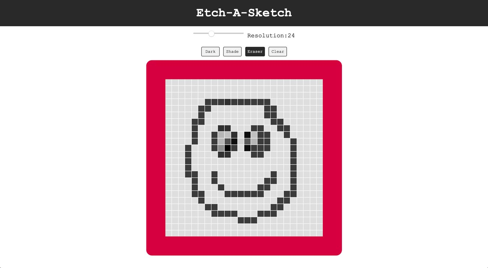

# _Etch-A-Sketch_

#### This is a browser-based sketch-pad that draws its inpiration from the classic mechanical drawing toy called the Etch-A-Sketch. 
#### _05/2021_

#### By _**Chris Korsak**_

## Description

This Etch-A-Sketch application was a really fun project from [The Odin Project](https://www.theodinproject.com/paths/foundations/courses/foundations/lessons/etch-a-sketch-project) Javascript Foundations course. It's a good exercise in what you can achieve with Document Object Model manipulation. In addition to the basic functionality of a classic Etch-A-Sketch toy, It also adds a couple cool behaviors that would be welcome with any person who has _actually used_ a real Etch-A-Sketch.

### Features
* Ability to set canvas resolution (4-64 squares per side)
* Single tone drawing tool
* Shade drawing tool to build up tone
* Eraser tool
* Clear button to reset the drawing canvas

## Setup/Installation Requirements

None. This is a web-based application hosted on Github pages. Check out the app [here!](https://chriskorsak.github.io/etch-a-sketch/)

## Technologies Used

* HTML
* CSS
* Javascript

## License

Copyright (c) 2021 **_Chris Korsak_** All rights reserved.
  
